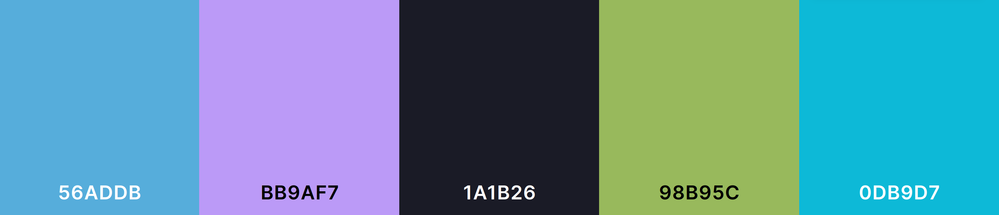

# Enquetinator
De enquetinator is een server side rendered enquete over de minor: Web Design & Devlopment van CMD Amsterdam. Omdat de site server side rendered is en Heroku geen free plan meer heeft :(, is de site niet live te bekijken. Volg [deze stappen](#Installatie) om de site lokaal te draaien.

## Features
* [x] Server side rendered
* [x] Functioneel zonder client side Javascript
* [x] Client side validation, fallback server side validation
* [x] Donker & licht thema
* [x] Extra getest op accessibility

## Geteste browsers
* [x] Google Chrome V111.0.5563.146
* [x] Mozilla Firefox v111.0.1 (Linux Mint)
* [x] Lynx v2.9.0dev.10
* [x] Samsung Internet v20.0.3.10
* [ ] Safari Desktop v?
* [ ] Safari Mobile v?
* [x] Flow v6.9.0 (Linux Mint)

## Testverslag


## Weekverslag

### Week 1

In week 1 ben ik begonnen met het opzetten van de structuur van mijn project. Dit heb ik gedaan door middel van een Express server, Handlebars view engine en typescript voor de server side code. Omdat deze site een server component heeft, kan de meeste Javascript al op de server worden uitgevoerd. Dit maakt het makkelijker om de site te laten werken wanneer client side Javascript is uitgeschakeld.

### Week 2

In week 2 ben ik verder gaan bouwen op de server side code van week 1. De logica voor het opslaan van de antwoorden per vak is geschreven. Hier hoef ik later alleen nog wat toevoegingen te doen om bepaalde velden / stukken optioneel te maken. Wanneer alles server side werkt zoals ik wil, ga ik client side Javascript toevoegen om de gebruikerservaring te verbeteren.

Verder ben ik deze week begonnen aan de styling. Omdat er zowel een dark als light thema moet komen, ben ik veel bezig geweest met kleuren kiezen. Hieronder een deel van mijn donker theme kleurenpallet, wat gedeeltelijk is gebaseerd op mijn VSCode thema.

<p align="center">
	
</p>

## Installatie
1. Clone de repository
```bash
$ git clone git@github.com:Laurens256/web-app-from-scratch-2223.git
```

2. Navigeer naar de gedownloade folder
```bash
$ cd enquentinator
```

3. Installeer de nodige (dev)dependencies
```bash
$ npm i
```

4. Start de web-app
```bash
$ npm run dev
```

5. Open de web-app in je browser
```
http://localhost:3000/
```
